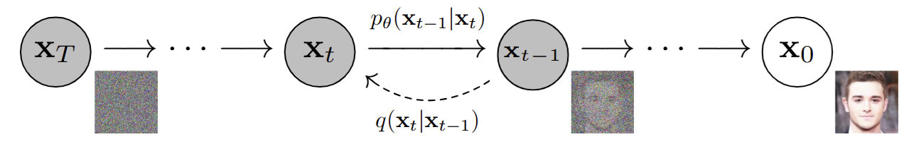
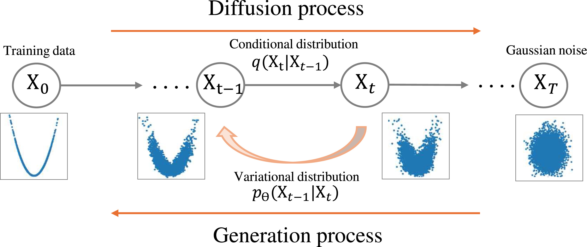

# AstroGen

AstroGen is a lightweight library of generative-model cores for astronomy
data: images, spectra, and simulations. It provides diffusion and VAE
building blocks as ordinary PyTorch modules, sharing a common tensor and
conditioning interface across dimensionalities, and leaves data loading,
preprocessing, and experiment infrastructure to the caller.

## Table of contents

- [Usage](#usage)
- [DDPM](#ddpm)
- [DeepLense VAE](#deeplense-vae)
- [CGDPM](#cgdpm)
- [Super-Resolution DDPM](#super-resolution-ddpm)
- [Denoising DDPM](#denoising-ddpm)
- [Resources](#resources)
- [Citations](#citations)

## Usage

Install AstroGen locally, editable, from the repository root:

```bash
pip install -e .
```

AstroGen uses ordinary PyTorch modules. Import an implementation directly from
its documented package, provide the tensor contract described by that model,
and use it in a standard PyTorch training or inference loop. Each section
below gives that contract and a minimal example.

## DDPM



[`DDPM`](astrogen/models/ddpm.py) implements [DDPM](https://arxiv.org/abs/2006.11239)
training and sampling around a diffusers U-Net and scheduler, with optional
class and channel conditioning. See the class docstring for the full
tensor contract.

```python
import torch
from diffusers import DDPMScheduler, UNet2DModel
from astrogen.models import DDPM

unet = UNet2DModel(
    in_channels=1, out_channels=1, layers_per_block=1,
    block_out_channels=(32, 64, 128),
    down_block_types=("DownBlock2D", "DownBlock2D", "DownBlock2D"),
    up_block_types=("UpBlock2D", "UpBlock2D", "UpBlock2D"),
    norm_num_groups=32,
)
model = DDPM(unet, DDPMScheduler(num_train_timesteps=1_000))
lens_images = torch.rand(8, 1, 64, 64) * 2 - 1
loss = model(lens_images)
samples = model.sample(count=4, sample_size=64)
```

Class-conditional (labels, e.g. `axion`/`CDM`/`no_sub` substructure type):

```python
unet = UNet2DModel(..., num_class_embeds=3)
model = DDPM(unet, DDPMScheduler(num_train_timesteps=1_000))
labels = torch.randint(3, (8,))
loss = model(lens_images, labels=labels)
samples = model.sample(count=4, sample_size=64, labels=torch.tensor([0, 1, 2, 2]))
```

Variable-conditional (continuous physical lens parameters, e.g. mass,
orientation, redshift), via [`ParameterEncoder`](astrogen/layers/parameter_encoder.py):

```python
from astrogen.layers import ParameterEncoder

base_channels = 32
unet = UNet2DModel(..., block_out_channels=(base_channels, base_channels * 2, base_channels * 4), class_embed_type="identity")
parameter_encoder = ParameterEncoder(num_parameters=3, embedding_dim=base_channels * 4)
model = DDPM(unet, DDPMScheduler(num_train_timesteps=1_000), parameter_encoder=parameter_encoder)
parameters = torch.stack([mass, orientation, redshift], dim=-1)
loss = model(lens_images, labels=parameters)
samples = model.sample(count=4, sample_size=64, labels=parameters[:4])
```

Channel-conditional (e.g. a low-resolution image for super-resolution, see
[Super-Resolution DDPM](#super-resolution-ddpm) below):

```python
unet = UNet2DModel(in_channels=2, out_channels=1, ...)  # image + condition channels
model = DDPM(unet, DDPMScheduler(num_train_timesteps=1_000), condition_channels=1)
condition = torch.rand(8, 1, 64, 64) * 2 - 1
loss = model(lens_images, condition=condition)
samples = model.sample(count=4, sample_size=64, condition=condition[:4])
```

## DeepLense VAE

[`DeepLenseVAE`](astrogen/models/vae.py) is a compact convolutional
[beta-VAE](https://openreview.net/forum?id=Sy2fzU9gl), extending the
[variational autoencoder](https://arxiv.org/abs/1312.6114) with a weighted KL
term, based on
[DeepLense's lens-image VAE](https://github.com/ML4SCI/DeepLense/blob/main/DeepLense_Diffusion_Rishi/models/vae.py),
generating images in a single decoder pass.

```python
import torch
from astrogen.models import DeepLenseVAE

model = DeepLenseVAE(latent_dimension=128)
lens_images = torch.rand(8, 1, 64, 64)
loss = model.loss(lens_images)
samples = model.sample(count=4)
```

## CGDPM



[`CGDPM`](astrogen/models/cgdpm.py) is the conditional Gaussian diffusion model
of the [DeepLense super-resolution reference](https://github.com/ML4SCI/DeepLense/blob/main/Super_Resolution_Atal_Gupta/models/cgdpm.ipynb),
using [linear attention](https://arxiv.org/abs/1812.01243),
[ReZero](https://arxiv.org/abs/2003.04887) residuals, and a
[cosine noise schedule](https://arxiv.org/abs/2102.09672). It customizes both
denoiser and noise process, so it's implemented directly rather than as a
diffusers subclass; see the class docstring for the tensor contract and its
documented departures from the source. For super-resolution, prefer
[Super-Resolution DDPM](#super-resolution-ddpm) below, which wraps `CGDPM`
and handles the low-resolution conditioning.

```python
import torch
from astrogen.models import CGDPM

model = CGDPM(image_channels=1, condition_channels=1)
lens_images = torch.rand(8, 1, 64, 64) * 2 - 1
condition = torch.rand(8, 1, 64, 64) * 2 - 1
loss = model(lens_images, condition)
samples = model.sample(count=4, sample_size=64, condition=condition[:4])
```

## Super-Resolution DDPM

[`SuperResolutionDDPM`](astrogen/tasks/super_resolution.py) conditions the
reverse process on a low-resolution image, the
[SR3](https://arxiv.org/abs/2104.07636) formulation of super-resolution as
conditional diffusion. It wraps [CGDPM](#cgdpm), bilinearly upsampling the
low-resolution image and passing it as that model's condition; see the class
docstring for the tensor contract and
[examples/train_super_resolution_cgdpm_star.ipynb](examples/train_super_resolution_cgdpm_star.ipynb)
for a full training example.

```python
import torch
from astrogen.tasks import SuperResolutionDDPM

model = SuperResolutionDDPM()
low_resolution = torch.rand(8, 1, 32, 32) * 2 - 1
high_resolution = torch.rand(8, 1, 64, 64) * 2 - 1
loss = model(low_resolution, high_resolution)
samples = model.sample(low_resolution, image_size=64)
```

## Denoising DDPM

[`DenoisingDDPM`](astrogen/tasks/denoising.py) restores a corrupted sample
with `DDPM`'s channel-conditioned path, reusing family C's SR corruption
recipe for images and [spectrai](https://github.com/conor-horgan/spectrai)'s
`spectral_denoising` task for its 1D counterpart. See the class docstring for
the tensor contract.

```python
import torch
from astrogen.tasks import DenoisingDDPM

model = DenoisingDDPM()
clean = torch.rand(8, 1, 64, 64) * 2 - 1
corrupted = clean + 0.1 * torch.randn_like(clean)
loss = model(corrupted, clean)
samples = model.sample(corrupted)
```

For spectra:

```python
from diffusers import UNet1DModel

model = DenoisingDDPM(model_cls=UNet1DModel)
clean_spectrum = torch.rand(8, 1, 500) * 2 - 1
corrupted_spectrum = clean_spectrum + 0.1 * torch.randn_like(clean_spectrum)
loss = model(corrupted_spectrum, clean_spectrum)
samples = model.sample(corrupted_spectrum)
```

## Resources

* [DeepLense](https://github.com/ML4SCI/DeepLense/tree/main): machine learning
  for strong gravitational lensing and dark matter substructure, on both
  simulated and real lensing images.
* [STAR](https://github.com/GuoCheng12/STAR/tree/main): Super-Resolution for
  Astronomical Star Fields, a benchmark for field-level super-resolution in
  astronomy.
* [Spectrai](https://github.com/conor-horgan/spectrai): a deep learning
  framework for training networks on spectral data and comparing methods.
* [Hubble meets Webb](https://github.com/vkinakh/Hubble-meets-Webb):
  image-to-image translation that predicts Webb images from Hubble images.

## Citations

Cite the generative method and the source authors linked in each
implementation.

```bibtex
@article{ho2020denoising,
  title={Denoising Diffusion Probabilistic Models},
  author={Ho, Jonathan and Jain, Ajay and Abbeel, Pieter},
  journal={arXiv preprint arXiv:2006.11239},
  year={2020}
}
```

```bibtex
@article{kingma2013autoencoding,
  title={Auto-Encoding Variational Bayes},
  author={Kingma, Diederik P. and Welling, Max},
  journal={arXiv preprint arXiv:1312.6114},
  year={2013}
}
```

```bibtex
@inproceedings{nichol2021improved,
  title={Improved Denoising Diffusion Probabilistic Models},
  author={Nichol, Alexander Quinn and Dhariwal, Prafulla},
  booktitle={International Conference on Machine Learning},
  year={2021}
}
```

```bibtex
@article{saharia2022image,
  title={Image Super-Resolution via Iterative Refinement},
  author={Saharia, Chitwan and Ho, Jonathan and Chan, William and Salimans, Tim and Fleet, David J. and Norouzi, Mohammad},
  journal={IEEE Transactions on Pattern Analysis and Machine Intelligence},
  year={2022}
}
```
